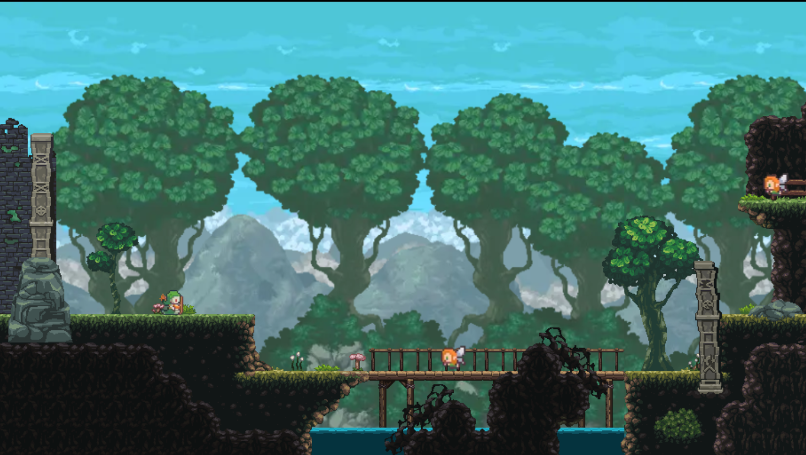

# Phaser esbuild TypeScript Template

This is a Phaser 3 project template that uses esbuild for bundling. It supports hot-reloading for quick development workflow, includes TypeScript support and scripts to generate production-ready builds.

**[This Template is also available as a JavaScript version.](https://github.com/phaserjs/template-esbuild)**

### Versions

This template has been updated for:

- [Phaser 3.87.0](https://github.com/phaserjs/phaser)
- [esbuild 0.21.2](https://github.com/evanw/esbuild)
- [TypeScript 5.4.5](https://github.com/microsoft/TypeScript)

## Requirements

[Node.js](https://nodejs.org) is required to install dependencies and run scripts via `npm`.

## Available Commands

| Command         | Description                                    |
| --------------- | ---------------------------------------------- |
| `npm install`   | Install project dependencies                   |
| `npm run dev`   | Launch a development web server                |
| `npm run build` | Create a production build in the `dist` folder |

## Writing Code

After cloning the repo, run `npm install` from your project directory. Then, you can start the local development server by running `npm run dev`.

The local development server runs on `http://localhost:4101` by default.

## Deploying to Production

After you run the `npm run build` command, your code will be built into a single bundle and saved to the `dist` folder, along with any other assets your project imported, or stored in the public assets folder.

In order to deploy your game, you will need to upload _all_ of the contents of the `dist` folder to a public facing web server.

## Customizing the Template

### esbuild

If you want to customize your build, such as adding plugin (i.e. for loading CSS or fonts), you can modify the `esbuild/build.prod.mjs` and `esbuild/dev.server.mjs` files for cross-project changes, or you can modify and/or create new configuration files and target them in specific npm tasks inside of `package.json`. Please see the [esbuild documentation](https://esbuild.github.io/api/) for more information.
